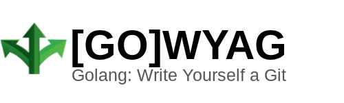

[](https://godoc.org/github.com/clagraff/gowyag)
[](http://goreportcard.com/report/clagraff/gowyag)


# [GO] WYAG
Golang: Write Yourself a Git.

This is a learning exercise in understanding some of the internal workings of
[git](https://git-scm.com/), through following the excellent tutorial
[Write Yourself a Git](wyag.thb.lt).

This repo aims to recreate the steps documented in the original WYAG site, 
except using Golang in lieu of Python.

## Development
### tl;dr

```bash
git clone git@github.com:clagraff/gowyag
go get
go build
./main
```

## License
Gowyag, a recreate of the original [Write Yourself a Git](wyag.thb.lt)
application, written in Golang.
Copyright (C) 2020 Curtis La Graff

This program is free software: you can redistribute it and/or modify
it under the terms of the GNU General Public License as published by
the Free Software Foundation, either version 3 of the License, or
(at your option) any later version.

This program is distributed in the hope that it will be useful,
but WITHOUT ANY WARRANTY; without even the implied warranty of
MERCHANTABILITY or FITNESS FOR A PARTICULAR PURPOSE.  See the
GNU General Public License for more details.

You should have received a copy of the GNU General Public License
along with this program.  If not, see <https://www.gnu.org/licenses/>.
